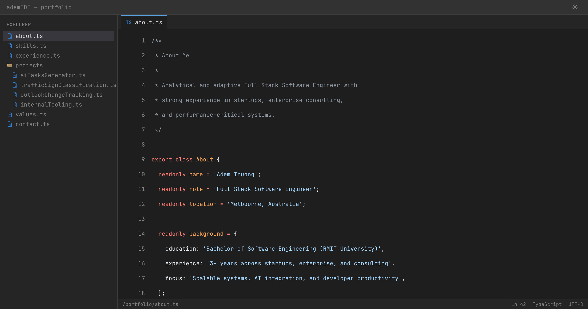

# ademIDE

My personal portfolio website — styled as a TypeScript IDE, because resumes are boring.

🔗 **Live:** [adem-ide.vercel.app](https://adem-ide.vercel.app)



## About

This is my software engineering portfolio, presented as an interactive code editor. Each "file" in the explorer contains a section of my portfolio — about me, skills, experience, projects, values, and contact info — all written as valid TypeScript.

## ✨ Features

- **IDE-style layout** — File tree sidebar, tabbed editor, status bar
- **Syntax highlighting** — Powered by Shiki with VS Code themes
- **Typing animation** — Code types out when you open a file
- **Blinking cursor** — Click any line to place the cursor
- **Dark/Light themes** — Toggle between VS Code Dark+ and Light+
- **Line numbers & highlighting** — Hover or click to highlight lines
- **Clickable links** — URLs and emails in code are interactive
- **Mobile responsive** — Collapsible sidebar for smaller screens

## 🛠 Built With

- **Next.js 16** — React framework with App Router
- **TypeScript** — Type-safe code
- **Tailwind CSS v4** — Utility-first styling
- **Shiki** — Syntax highlighting
- **JetBrains Mono** — Monospace font

## 🚀 Run Locally

```bash
git clone https://github.com/ademtru/ademIDE.git
cd ademIDE
npm install
npm run dev
```

## 📁 Structure

```
src/
├── app/                  # Next.js app router
├── components/           # IDE components (file tree, editor, etc.)
└── lib/
    └── portfolio-content.ts  # ← Edit this to update portfolio content
```

## ✏️ Customise

To use this as your own portfolio, edit `src/lib/portfolio-content.ts` — each file in the tree is a TypeScript string that gets syntax-highlighted.

## � Contact

- **Email:** ademtruong@gmail.com
- **GitHub:** [@ademtru](https://github.com/ademtru)
- **LinkedIn:** [ademtruong](https://linkedin.com/in/ademtruong)

## 📄 License

MIT — feel free to fork and make it your own!
